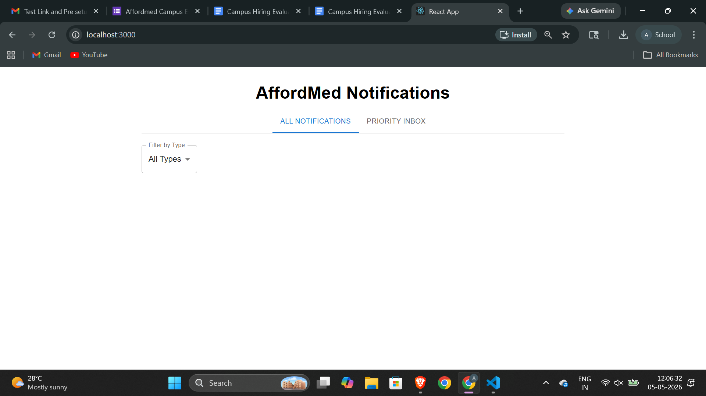
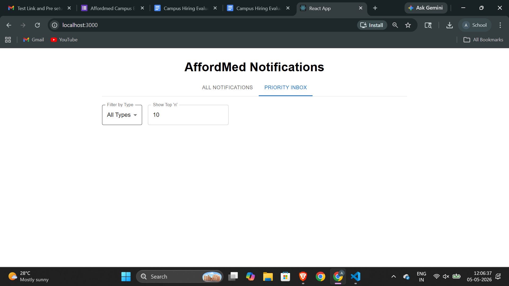

# Stage 1: Notification System Design & API Contract

### Core Actions
The notification platform supports the following primary actions to ensure a seamless user experience:
*   **Fetch Notifications:** Retrieve a list of notifications for the authenticated user.
*   **Mark as Read:** Update the status of a specific notification.
*   **Mark All as Read:** Bulk update all unread notifications to a "read" state.
*   **Delete Notification:** Remove a notification from the user's view.

### REST API Endpoints

**1. Get All Notifications**
*   **Endpoint:** `GET /api/v1/notifications`
*   **Headers:**
    ```json
    {
      "Authorization": "Bearer <JWT_TOKEN>",
      "Accept": "application/json"
    }
    ```
*   **Response (200 OK):**
    ```json
    {
      "success": true,
      "data": [
        {
          "id": "uuid-12345",
          "type": "ALERT",
          "title": "Security Alert",
          "message": "New login detected from Chrome on Windows.",
          "is_read": false,
          "created_at": "2026-05-05T10:20:00Z"
        }
      ]
    }
    ```

**2. Mark Notification as Read**
*   **Endpoint:** `PATCH /api/v1/notifications/{id}/read`
*   **Headers:** `{"Authorization": "Bearer <JWT_TOKEN>"}`
*   **Response (200 OK):**
    
```json
    {
      "success": true,
      "message": "Notification marked as read."
    }
    ```

### Real-time Notification Mechanism
To provide real-time updates without manual refreshing, the system will implement **WebSockets (WS)**. 
*   **Implementation:** When a user logs in, the client establishes a persistent connection to the WebSocket server (`ws://[api.notifications.com/connect](https://api.notifications.com/connect)`). 
*   **Workflow:** When a background event occurs, the server identifies the active connection for that `user_id` and pushes a JSON payload directly to the client. This is preferred over Polling as it reduces server overhead and provides sub-second latency.

---

# Stage 2: Data Persistence & Scalability

### Persistent Storage Choice
I suggest using **PostgreSQL** (Relational Database) for this system.
*   **Reasoning:** Notification data is highly structured. PostgreSQL offers robust support for JSONB (if payloads vary), ACID compliance to ensure notification status is never lost, and excellent indexing capabilities for fast retrieval based on `user_id`.

### Database Schema (SQL)
```sql
CREATE TABLE notifications (
    id UUID PRIMARY KEY DEFAULT gen_random_uuid(),
    user_id UUID NOT NULL,
    type VARCHAR(50),
    title TEXT NOT NULL,
    message TEXT NOT NULL,
    is_read BOOLEAN DEFAULT FALSE,
    created_at TIMESTAMP WITH TIME ZONE DEFAULT CURRENT_TIMESTAMP
);

-- Index for performance
CREATE INDEX idx_user_unread ON notifications (user_id) WHERE is_read = FALSE;
```

### Scalability Analysis
**Potential Problems:**
1.  **Read Latency:** As the `notifications` table grows to millions of rows, fetching unread notifications for a specific user becomes slower.
2.  **Storage Costs:** Users rarely check notifications older than 30 days, yet they occupy high-performance disk space.

**Solutions:**
*   **Horizontal Partitioning (Sharding):** Partition the database by `user_id` so that any single query only searches a small subset of the total data.
*   **Indexing:** Use B-Tree indexes on `user_id` and `created_at`.
*   **Data Archiving:** Move notifications older than 60 days to a cheaper "cold storage" (like S3 or a data warehouse) or delete them to keep the main table lean.

### Database Queries

**1. Fetch unread notifications for a user:**
```sql
SELECT id, title, message, created_at 
FROM notifications 
WHERE user_id = 'user-uuid-here' 
AND is_read = FALSE 
ORDER BY created_at DESC;
```

**2. Mark a notification as read:**
```sql
UPDATE notifications 
SET is_read = TRUE 
WHERE id = 'notification-uuid-here' 
AND user_id = 'user-uuid-here';
```

```


# Stage 5: High-Volume Reliability & Architecture

### Shortcomings of the Current Implementation
The current synchronous `for-loop` implementation has three major flaws:
1. **Single Point of Failure:** If the `send_email` call fails or the script crashes midway, the remaining students never receive their notifications.
2. **Performance Bottleneck:** Processing 50,000 notifications sequentially is extremely slow. The HR's request would likely time out before the loop finishes.
3. **Lack of Retries:** There is no mechanism to handle partial failures (like the 200 failed emails).

### Proposed Redesign: Asynchronous Message Queue
To make this reliable and fast, I recommend decoupling the notification trigger from the execution using a **Message Queue (e.g., RabbitMQ or Redis)**.

**Why decouple?**
* **Concurrency:** Multiple "Worker" services can process the queue simultaneously, sending thousands of emails per minute.
* **Retries:** If an email fails, the task can be put back in the queue to be retried automatically.
* **Separation of Concerns:** Saving to the DB and sending emails should happen independently. A DB failure shouldn't stop an email from being sent.

### Revised Pseudocode
```javascript
// HR Trigger Function
function notify_all(student_ids, message) {
    for (student_id in student_ids) {
        // Just push a small "task" to the queue and move to the next
        message_queue.push({
            student_id: student_id,
            message: message,
            retry_count: 0
        });
    }
    return "Notifications are being processed.";
}

// Background Worker (Runs in multiple instances)
function worker_process() {
    while (task = message_queue.pop()) {
        try {
            save_to_db(task.student_id, task.message);
            send_email(task.student_id, task.message);
            push_to_app(task.student_id, task.message);
        } catch (error) {
            if (task.retry_count < 3) {
                task.retry_count++;
                message_queue.push(task); // Retry logic
            } else {
                log_permanent_failure(task);
            }
        }
    }
}

# Stage 6: Priority Inbox Implementation

### Approach
To maintain a "Priority Inbox," I implemented a weighted sorting algorithm. Each notification type is assigned a numerical value: **Placement (3), Result (2), and Event (1)**. 

### Efficiency in a Live System
In a production environment where notifications keep coming in, sorting the entire list every time is inefficient. To maintain the "Top 10" efficiently:
1. **Min-Heap Data Structure:** We can use a Min-Heap of size 10. When a new notification arrives, we compare it with the lowest priority item in the heap. If the new one is higher, we replace the root and heapify. This keeps complexity at $O(log 10)$.
2. **Real-time Updates:** The frontend should maintain this heap locally to update the UI instantly without re-fetching the entire list.


